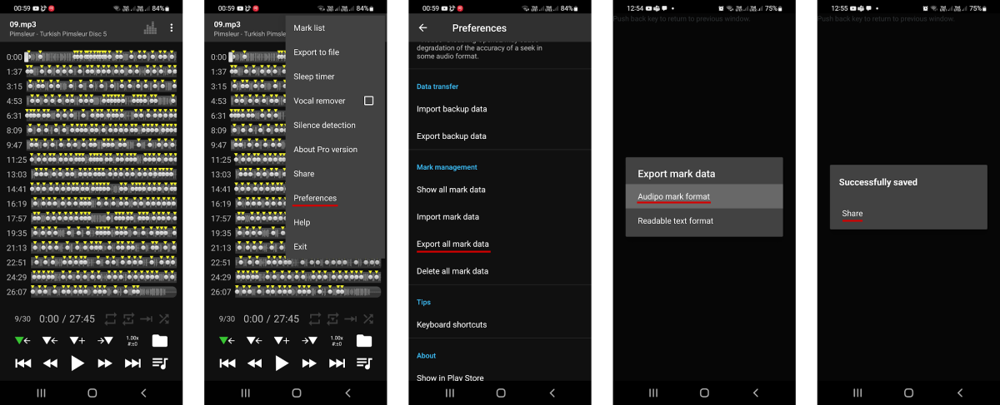
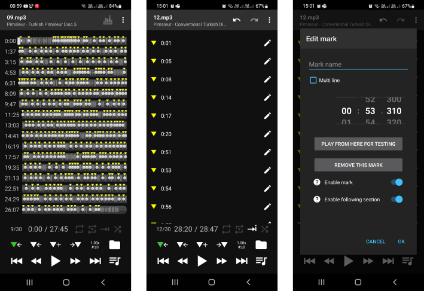

# Audipo Marks manager

`audipomarks` is an [Audipo](#what-is-audipo) player [marks](#what-are-marks) manager, that allows you to:

- split the all-marks file exported by Audipo player into smaller chunks and distribute them among the directories they refer to;

- recursively join multiple directory-level marks files into the all-marks one, that you can then import back into Audipo.

## Usage

### TL;DR

Install:

```
$ npm i -g audipomarks
```

Split:

```
audipomarks split --root=MyMedia exported.audipomark
```

Join:

```
audipomarks join .
```

### Prerequisites

#### Required software

`audipomarks` is written on JavaScript, and so you need to install [Node.js 16.x](https://nodejs.org/en/) and [npm 8.x](https://www.npmjs.com/package/npm).

> 💡 I recommend using [`nvm`](https://github.com/nvm-sh/nvm) for getting both node and npm. It also lets you to install packages globally (`npm i -g ...`) w/o administrator priviledges.


#### Media arrangement

Let's assume you have a folder with your media files somewhere on your phone, and also have it copied to your PC.

> 💡 Ideally you'd want to have this folder synced with your PC automatically, using tools like FolderSync or AutoSync. They do a really good job at syncing folders with cloud drives — Google Drive, Dropbox, Yandex.Disk etc

To be specific, let's imagine that you keep your media files at `MyMedia/` on your phone:

```
/storage/emulated/0/MyMedia
```

and have it already copied to your PC at:

```
/home/me/MyMedia
```

> 💡 With FolderSync, you just add a folder-level rule, and get those two directories in sync all the time.

We'll be referring this setup below.

### Install

**Global installation (recommended)**

```
$ npm i -g audipomarks
```

Now you can run it from anywhere w/o any prefixes or paths, e.g.:

```
$ audipomarks <params>
```

**Local installation (not recommended)**

<details>
  <summary>Expand...</summary>

```
$ npm i audipomarks
```

Now you run `audipomarks` from the current directory as:

```
$ node_modules/.bin/audipomarks <params>
```

or with [`npx`](https://www.npmjs.com/package/npx) (part of `npm`):

```
$ npx audipomarks <params>
```

</details>

### Exporting marks data

Open Audipo app, go to **Preferences**, tap **Export all marks data**, then **Audipo marks format** on the next screen and finally tap **Share** to save the marks file somewhere, from where you can easily transfer it to your PC.



The filename will look like `exportedmarks20220706_020654.audipomark`.

Going back to our example, let's assume that you saved the file in `MyMedia/` on your phone, and then copied it to `/home/me/MyMedia/` on PC.

> 💡 With FolderSync, you'd have it copied automatically.

So now you should have your media files along with the exported all-marks file in your `/home/me/MyMedia/`:

```
/home/
  me/
    MyMedia/
      exportedmarks20220706_020654.audipomark
      Lessons/
        Lesson1.mp3
        Lesson2.mp3
        MoreLessons/
          NewLesson1.mp3
          NewLesson2.mp3
      Songs/
        ...
```

## Splitting

Now that you have your all-marks data file in place on your PC, you're ready to disassemble it through directories with the actual audio files:

```
$ audipomarks split --root=MyMedia /home/me/MyMedia/exportedmarks20220706_020654.audipomark
```

The required `--root` parameter specifies the location of the user media directory (`MyMedia/`) **on your phone**.
It can use either absolute or relative path:

- **absolute**, e.g.: `/storage/emulated/0/MyMedia` or
- **relative**, i.e.: `MyMedia`

The `split` command will:

- parse the all-marks file,
- check all the directories and files from it,
- split the data by smaller marks files
- and save them under the `local.audipomark` name in the directories they refer to.

So your should end up with 3 new files:

```
/home/
  me/
    MyMedia/
      exportedmarks20220706_020654.audipomark
      Lessons/
        local.audipomark
        Lesson1.mp3
        Lesson2.mp3
        MoreLessons/
          local.audipomark
          NewLesson1.mp3
          NewLesson2.mp3
      Songs/
        local.audipomark
        ...
```

## Working with directory-level marks files

Each `local.audipomark` file references only files from the directory it's saved into.

For example, the first `local.audipomark` from above will keep marks from `Lesson1.mp3` and `Lesson2.mp3` but not from `MoreLessons/` subdirectory.

Also, `local.audipomark` files don't keep their original (phone) locations and hence their containing directories can now be relocated according to your preferences.

Things you can do now:

- Rename directories
- Move directories to new locations within your media directory
- Generate marks using tools like [audio-silence-marks](https://pypi.org/project/audio-silence-marks/)

### Joining

After you're finished with refactoring locations of your media or with updating marks files, you're now ready to build the all-marks file and import it back into Audipo.

```
$ audipomarks join /home/me/MyMedia
```

This command will:

- find all `local.audipomark` files below `/home/me/MyMedia`,
- join them back into one solid marks file
- and save it to `/home/me/MyMedia/global.audipomark`.

You can now import it back into Audipo:

1. Transfer the `global.audipomark` file to your phone.

> 💡 With FolderSync, you'd have it in place automatically.

2. Delete the old marks data: **Preferences > Delete all mark data**
3. Import the new all-marks file: **Preferences > Import mark data**

You're done, congratulations!

## TODO

- [ ] Bring functionality from [audio-silence-marks](https://pypi.org/project/audio-silence-marks/) into this tool, but preserving the directory-scoped marks file paradigm (`audio-silence-marks` ends up with just one file for a subtree)

## Audipo and marks

### What is Audipo?

[Music Speed Changer: Audipo](https://play.google.com/store/apps/details?id=jp.ne.sakura.ccice.audipo&hl=en&gl=US) is an audio player for Android.

It's a swiss-knife for tasks like:

- learning foreign languages;
- transcribing interviews and other audio recordings;
- learning poems and songs.

It features:

- Nice support for Bluetooth remote control devices.
- Setting playback stop points, called **marks**.
- Changing the pitch (to match your own vocal range).
- Changing the playback speed (this one is regular, but still...).

And many more.

### What are marks?

Marks are basically a list of timecodes. They are usually used as stop points for the player to allow for A-B repetition or for fast and precise navigation through an audio recording.

In Audipo player you create marks by tapping the  button.

You can also open the list of mark in a separate window and fine-adjust any mark with the precision of hundredths of a second.


